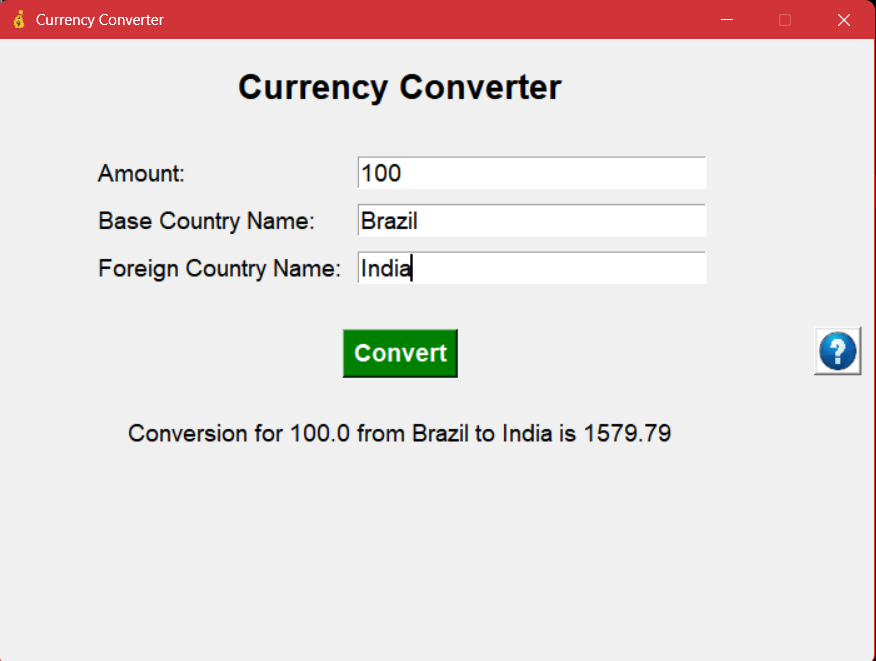

# Currency Converter App

A simple Currency Converter desktop application made with Python. This tool allows users to convert amounts between different world currencies using up-to-date exchange rates.

## Features

- Convert between major world currencies.
- Simple, user-friendly interface.
- Real-time exchange rates (requires internet connection).

## What the App Looks Like



## Getting Started

### Prerequisites

- Python 3.13 installed on your machine.

### Clone the Repository

Open your terminal or command prompt and run:

```bash
git clone https://github.com/aniTech-addict/Python_mini_projects.git
cd Python_mini_projects/Currency_converter_app
```

### Install Dependencies

Install dependencies with:

```bash
pip install -r requirements.txt
```
Or, manually install common dependencies (update as needed for your project):

```bash
requests==2.31.0
python-dotenv==1.0.0
Pillow==10.2.0
```

### How to Run

The main script is `gui_app.py`. To run:

```bash
python gui_app.py
```

## Folder Structure

```
Currency_converter_app/
├── Images/
├── gui_app.py                        # Graphical interface of APP
├── main.py                           # terminal focused interaction 
├── currency_value_grabber.py         # defines methods to make API requests to grab latest conversion rates
├── supported_contry_codes.py         # Lookup table for Country name to Country code conversion
├── requirements.txt                  # required dependencies 
```

## Contributing

Feel free to fork this repository and submit pull requests. For major changes, please open an issue first.

## License

[MIT](../LICENSE) (or specify your license)

---

*This project is part of the [Python Mini Projects](https://github.com/aniTech-addict/Python_mini_projects) collection.*